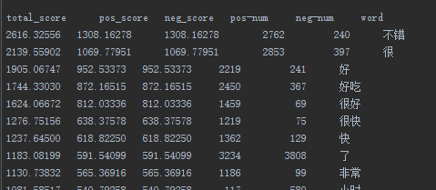
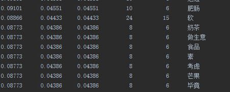
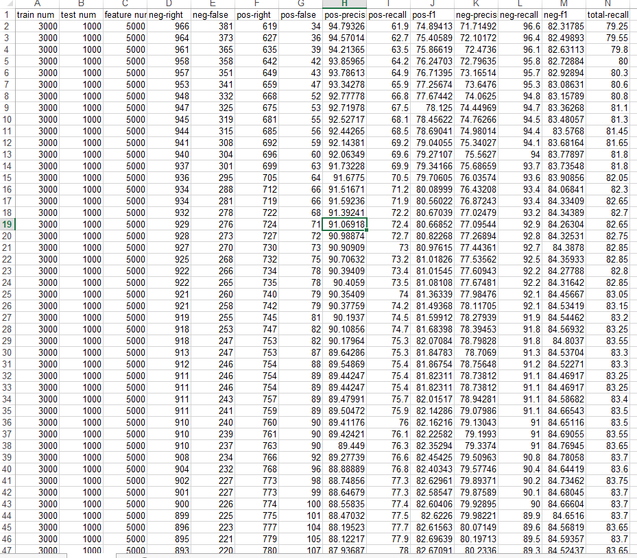

## 0、情感极性分析介绍
「情感极性分析」是对带有感情色彩的主观性文本进行分析、处理、归纳和推理的过程。按照处理文本的类别不同，可分为基于新闻评论的情感分析和基于产品评论的情感分析。
  其中，前者多用于舆情监控和信息预测，后者可帮助用户了解某一产品在大众心目中的口碑。
目前常见的情感极性分析方法有很多种，本项目选取了下面五个方法来分析不用方法之间的分析效率：
（1）基于情感词典的情感极性分析 
（2）基于k-NN的情感极性分析
（3）基于Bayes的情感极性分析 
（4）基于最大熵的情感极性分析
（5）基于SVM的情感极性分析 
## 1、预处理
### （1）、特征提取
- 对应文件：feature_extraction.py

最后结果：

X^2值前几名的词语。能看出这些词都是一些有效的情感词。“了”这样的词出现在其中，说明可以去除一些停用词，来进一步提高分类精度。

X^2值后几名的词语。能看出这些词的分类作用不是很大。

### （2）、结果评价
- 对应文件：tools.py

结果展示

## 2、基于情感词典的情感极性分析 
—— sentiment analysis based on sentiment dict

- 对应文件：classifier.py  DictClassifier

### 使用1：analyse_sentence
analyse_sentence(sentence, runout_filepath=None, print_show=False)

对单个句子进行情感极性分析

- sentence，待分析的句子

- 若runout_filepath指定，则将分析结果写入该文件；

- 若print_show为True，则在控制台输出分析结果。

运行实例：
    
    d = DictClassifier()
    a_sentence = "剁椒鸡蛋好咸,土豆丝很好吃"
    result = ds.analyse_sentence(a_sentence)
    print(result)

### 使用2:analysis_file
analysis_file(filepath_in, filepath_out, encoding="utf-8", print_show=False, start=0, end=-1)

- filepath_in，待分析的句子文件

- filepath_out，分析结果输出文件

- encoding，输入文件字符编码

- print_show，是否在控制台输出

- start，输入文件开始分析的句子行数

- end，输入文件结束分析的句子行数

输出实例：

    送餐快，态度好！味道不错。
    Score:6.0
    Sub-clause0: positive:快 
    Sub-clause1: positive:好 punctuation:！ 
    Sub-clause2: positive:不错 
    
    还可以，比预计时间晚了一小时到，不过还好
    Score:-0.56
    Sub-clause0: positive:还可以 
    Sub-clause1: negative:晚……小时:晚了一小时 小时 
    Sub-clause2: conjunction:不过 positive:还好

## 3、基于k-NN的情感极性分析 
—— sentiment analysis based on k-NN

### single_k_classify(input_data)

使用单个k值

    k = 3
    
    knn = KNNClassifier(train_data, train_labels, k=2, best_words=best_words)
    classify_labels = []

    print("KNNClassifiers is testing ...")
    for data in self.test_data:
        classify_labels.append(knn.classify(data))
    print("KNNClassifiers tests over.")

    filepath = "f_runout/KNN-train-%d-test-%d-k-%s-%s.xls" % \
               (train_num, test_num, k,
                datetime.datetime.now().strftime("%Y-%m-%d-%H-%M-%S"))

    results = get_accuracy(test_labels, classify_labels)
    Write2File.write_contents(filepath, results)

### multiple_k_classify(input_data)

使用多个k值

    from spa.classifiers import KNNClassifier
    
    k = [1, 3, 5, 7, 9, 11, 13]
    
    knn = KNNClassifier(train_data, train_labels, k=2, best_words=best_words)
    classify_labels = []

    print("KNNClassifiers is testing ...")
    for data in self.test_data:
        classify_labels.append(knn.classify(data))
    print("KNNClassifiers tests over.")

    filepath = "f_runout/KNN-train-%d-test-%d-k-%s-%s.xls" % \
               (train_num, test_num, '-'.join([str(i) for i in k]),
                datetime.datetime.now().strftime("%Y-%m-%d-%H-%M-%S"))

    results = get_accuracy(test_labels, classify_labels)
    Write2File.write_contents(filepath, results)

### 比较结论

在某些特定数据下，multiple_k比每个single_k效果要好。但并不是总是最好。

## 4、基于Bayes的情感极性分析 
—— sentiment analysis based on bayes
    
    from spa.classifiers import BayesClassifier
    
    bayes = BayesClassifier(self.train_data, self.train_labels, self.best_words)

    classify_labels = []
    print("BayesClassifier is testing ...")
    for data in self.test_data:
        classify_labels.append(bayes.classify(data))
    print("BayesClassifier tests over.")

    filepath = "f_runout/bayes-train-%d-test-%d-k-%s-%s.xls" % \
               (train_num, test_num, '-'.join([str(i) for i in k]),
                datetime.datetime.now().strftime("%Y-%m-%d-%H-%M-%S"))

    results = get_accuracy(test_labels, classify_labels)
    Write2File.write_contents(filepath, results)

## 5、基于最大熵的情感极性分析 
—— sentiment analysis based on maximum entropy

### 使用1：得到每次迭代的准确率的变化

    def test_maxent_iteration(self):
        print("MaxEntClassifier iteration")
        print("---" * 45)
        print("Train num = %s" % self.train_num)
        print("Test num = %s" % self.test_num)
        print("maxiter = %s" % self.max_iter)

        from spa.classifiers import MaxEntClassifier

        m = MaxEntClassifier(self.max_iter)
        iter_results = m.test(self.train_data, self.train_labels, self.best_words, self.test_data)

        filepath = "f_runout/MaxEnt-iteration-%s-train-%d-test-%d-f-%d-maxiter-%d-%s.xls" % \
                   (self.type,
                    self.train_num,
                    self.test_num,
                    self.feature_num,
                    self.max_iter,
                    datetime.datetime.now().strftime(
                        "%Y-%m-%d-%H-%M-%S"))

        results = []
        for i in range(len(iter_results)):
            try:
                results.append(get_accuracy(self.test_labels, iter_results[i], self.parameters))
            except ZeroDivisionError:
                print("ZeroDivisionError")

        Write2File.write_contents(filepath, results)

### 使用2：单个句子的情感极性划分

    def test_maxent(self):
        print("MaxEntClassifier")
        print("---" * 45)
        print("Train num = %s" % self.train_num)
        print("Test num = %s" % self.test_num)
        print("maxiter = %s" % self.max_iter)

        from spa.classifiers import MaxEntClassifier

        m = MaxEntClassifier(self.max_iter)
        m.train(self.train_data, self.train_labels, self.best_words)

        print("MaxEntClassifier is testing ...")
        classify_results = []
        for data in self.test_data:
            classify_results.append(m.classify(data))
        print("MaxEntClassifier tests over.")

        filepath = "f_runout/MaxEnt-%s-train-%d-test-%d-f-%d-maxiter-%d-%s.xls" % \
                   (self.type,
                    self.train_num, self.test_num,
                    self.feature_num, self.max_iter,
                    datetime.datetime.now().strftime(
                        "%Y-%m-%d-%H-%M-%S"))

        self.write(filepath, classify_results, 1)

## 6、基于SVM的情感极性分析 
—— sentiment analysis based on SVM

依赖于scikit-learn库。准确率较高！

    def test_svm(self):
        print("SVMClassifier")
        print("---" * 45)
        print("Train num = %s" % self.train_num)
        print("Test num = %s" % self.test_num)
        print("C = %s" % self.C)

        from spa.classifiers import SVMClassifier
        svm = SVMClassifier(self.train_data, self.train_labels, self.best_words, self.C)

        classify_labels = []
        print("SVMClassifier is testing ...")
        for data in self.test_data:
            classify_labels.append(svm.classify(data))
        print("SVMClassifier tests over.")

        filepath = "f_runout/SVM-%s-train-%d-test-%d-f-%d-C-%d-%s-lin.xls" % \
                   (self.type,
                    self.train_num, self.test_num,
                    self.feature_num, self.C,
                    datetime.datetime.now().strftime(
                        "%Y-%m-%d-%H-%M-%S"))

        self.write(filepath, classify_labels, 2)

## 7、几种情感分析方法比较

### 基于词典
- 准确率：准确率较高（80%以上），随着人工工作量的增加，准确率增加

- 优点：易于理解

- 缺点：人工工作量大

### 基于k_NN
- 准确率：很低（60% - 70%）

- 优点：思想简单、算法简单

- 缺点：准确率低；耗内存；耗时间

### 基于Bayes
- 准确率：还可以（70% - 80%）

- 优点：简单，高效，运算速度快，扩展性好

- 缺点：准确率不高，达不到实用

### 基于最大熵
- 准确率：比较高（83%以上）

- 优点：准确率高

- 缺点：训练时间久

### 基于SVM
- 准确率：最高（85%以上）

- 优点：准确率高

- 缺点：训练耗时
